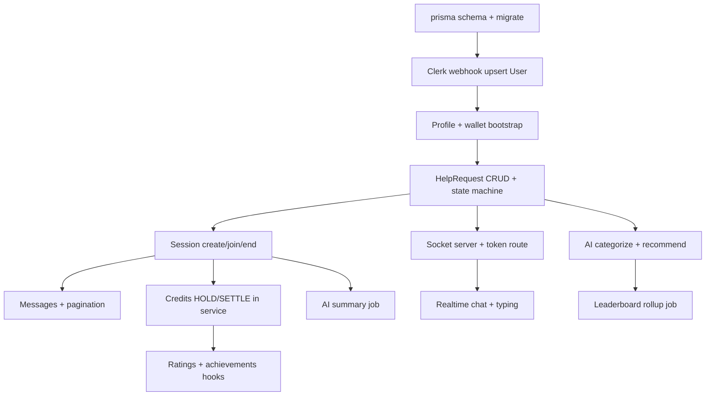

# LearnLoop — backend & database foundation

This document extends the implemented code in `prisma/schema.prisma`, `src/lib/**`, `src/server/**`, and `src/app/api/**`. Pair with `docs/API_REFERENCE.md` for per-endpoint contracts.

---

## 1. Prisma schema (implemented)

**Location:** `prisma/schema.prisma`

**Design principles:**

- **Microcredits (`BigInt`)** — avoid float money; serialize to string in JSON APIs.
- **Append-only `Transaction`** — audit trail; `balanceAfterMicrocredits` avoids full replay for statements.
- **`CreditWallet.version`** — optimistic concurrency for hot wallets.
- **Soft delete on `User`** — `deletedAt` preserves foreign keys for compliance.
- **1:1 `Session` ↔ `HelpRequest`** — simplifies MVP matching; migrate to 1:N if product allows reopen.
- **`LeaderboardStats` upsert key** — `(userId, scope, window, periodKey, campusSlug)` with `campusSlug` default `""` to avoid Postgres NULL unique quirks.
- **`Message.clientMessageId`** — idempotent HTTP sends dedupe network retries.
- **`HelpRequestInterest`** — many tutors per request without abusing `Session` rows.

**Optional DB extension:** enable `citext` for case-insensitive email uniqueness — add raw SQL migration when ops approves; app currently uses plain `String`.

---

## 2. Database indexing strategy

### `users`

- **`@@index([createdAt])`** — admin/user growth analytics.
- **`@@index([role, deletedAt])`** — admin moderation queues.
- **Hot path:** lookup by `clerkUserId` uses **unique index** (automatic).

### `profiles`

- **`@@index([campusSlug])`** — campus-scoped discovery.
- **`@@index([onboardingCompletedAt])`** — funnel queries (“stuck in onboarding”).

### `tutor_profiles`

- **`@@index([isAcceptingRequests])`** — tutor feed filter.
- **`@@index([averageRating])`** — sort-heavy browse (pair with `WHERE isAcceptingRequests = true` in queries).

### `transactions`

- **`@@index([walletId, createdAt(sort: Desc)])`** — wallet statement pagination (keyset: `(createdAt, id)` in app when needed).
- **`@@index([referenceKind, referenceId])`** — trace credits for a session/request.
- **Unique `idempotencyKey`** — O(1) dedupe on retry.

### `help_requests`

- **Composite `(status, subjectSlug, createdAt DESC)`** — primary “open board” feed.
- **`(authorId, status, createdAt DESC)`** — “my requests”.
- **`acceptedTutorId`** — tutor’s active queue.
- **`expiresAt`** — cron to `EXPIRED`.

**Heavy queries:** open feed by subject + cursor pagination — **always** filter `status` first to match partial index friendliness (add partial index in migration: `WHERE status = 'OPEN'` for scale).

### `help_request_interests`

- **Unique `(requestId, tutorUserId)`** — idempotent interest.
- **`(tutorUserId, createdAt DESC)`** — tutor history.

### `sessions`

- **Tutor/student composites with `status`** — dashboards.
- **Unique `helpRequestId`** — one session per request (MVP).

### `messages`

- **`(sessionId, createdAt DESC)`** — chat infinite scroll (keyset on `(createdAt, id)`).

### `ratings`

- **Unique `(sessionId, fromUserId)`** — one review per rater per session.
- **`(toUserId, createdAt DESC)`** — tutor profile.

### `notifications`

- **`(userId, status, createdAt DESC)`** — unread inbox.
- **`(userId, createdAt DESC)`** — full inbox.

### `leaderboard_stats`

- **Leaderboard read:** `(scope, window, periodKey, points DESC)` and campus variant — precomputed writes, cheap reads.

### `ai_tags`

- **`(entityKind, entityId)`** — fetch tags for an entity.
- **`helpRequestId` / `sessionSummaryId`** — join shortcuts.

### `session_summaries`

- **`(sessionId, createdAt DESC)`** — regen history.

### `user_presence`

- **`(status, lastSeenAt)`** — “who’s online” campus slices (still prefer Redis for true scale).

### `bookmarks`

- **Unique `(userId, bookmarkType, targetId)`**.

### `study_roadmaps`

- **`(userId, status, updatedAt DESC)`**.

### Pagination & sorting

- **Prefer keyset** (`WHERE (createdAt, id) < ($cursorTs, $cursorId)`) over `OFFSET` for large tables (`messages`, `transactions`, `notifications`).
- **Sort tie-breaker:** always include stable secondary key (`id`).

---

## 3. HTTP API architecture

**Versioning:** `/api/v1/...` — bump when breaking response shapes; maintain v1 for mobile clients.

**Organization:**

- `src/app/api/health` — unversioned liveness.
- `src/app/api/webhooks/*` — third-party ingress, raw body.
- `src/app/api/v1/*` — JSON product API.
- `src/lib/api/handler.ts` — `createApiHandler` wraps validation + errors + `requestId`.

**Controller vs service:**

- **Route file** — HTTP concerns only (parse, status, headers).
- **`src/server/services/*`** — transactions, domain rules, emits socket events (via publisher abstraction).
- **`src/server/repositories/*`** — Prisma I/O, no business rules.

**Response standard:** `src/types/api.ts` + `src/lib/api/response.ts`.

**Errors:** `AppError` → JSON `code` + HTTP status; unknown → `500` + logged requestId (never leak stack to client).

---

## 4. Server Actions strategy (Next.js)

**Use Server Actions for:**

- Form-heavy mutations tied to a page (`onboarding`, `profile` edit).
- Mutations that benefit from **progressive enhancement** (no JS client).

**Prefer Route Handlers for:**

- Webhooks (raw body), **non-JSON** uploads, **third-party callbacks**.
- Public APIs / mobile clients expecting pure REST.
- Socket token minting (`/api/v1/realtime/token`).

**Mutation pattern:**

1. `auth()` / `currentUser()`.
2. Authorize in **service** (not only UI).
3. Prisma `$transaction`.
4. `revalidateTag('user:' + id)` for RSC segments.
5. Return discriminated union `{ ok: true, data } | { ok: false, code }` to client for optimistic rollback.

**Optimistic UI:** safe for notifications read, chat UI; **never** for credits without server ack.

**Cache invalidation:** Next `revalidateTag` + TanStack `invalidateQueries` from client after action success (when client exists).

---

## 5. Socket.IO architecture (standalone service)

**Why separate:** Vercel functions are not a durable WebSocket host; deploy Socket.io on Fly/Railway/ECS with **Redis adapter** when horizontally scaling.

### Namespaces

- **`/`** — product default.
- **`/admin`** (later) — moderator tools, separate auth claims.

### Rooms

| Room pattern | Members | Purpose |
|--------------|---------|---------|
| `user:{internalUserId}` | single user | notifications, achievements |
| `request:{requestId}` | browsers viewing request | interest counts, typing |
| `session:{sessionId}` | participants | chat + session state |
| `campus:{slug}:presence` | optional | large presence fanout |

### Auth middleware (handshake)

1. Client `POST /api/v1/realtime/token` with Clerk session.
2. Server verifies user, loads internal `userId`, builds JWT `{ sub, allowedRooms, exp }`.
3. Socket server verifies JWT, attaches `socket.data.userId`.

### Heartbeat / presence

- Client emits `presence:heartbeat` every 25–45s.
- Server upserts `UserPresence` (DB) **or** Redis key `presence:{userId}` with TTL 120s (prefer Redis at scale).
- `user:{id}` receives `presence:online` / `presence:offline` for friends list (optional product).

### Reconnect

- Client on `reconnect`: refetch REST `/messages` since last watermark `messageId`.
- Server on `disconnect`: delay 30s before broadcasting offline (handle tab switch).

### Event payloads (summary)

| Event | Direction | Payload |
|-------|-----------|---------|
| `request:created` | S→C | `{ requestId, authorId, subjectSlug, title, createdAt }` |
| `tutor:matched` | S→C | `{ requestId, sessionId, tutorUserId }` |
| `notification:new` | S→C | `{ notificationId, type, title, body, createdAt }` |
| `session:started` | S→C | `{ sessionId, startedAt }` |
| `session:ended` | S→C | `{ sessionId, endedAt, reason? }` |
| `typing:update` | both | `{ context: 'request'|'session', id, userId, isTyping }` |
| `presence:online` | S→C | `{ userId, lastSeenAt }` |
| `dashboard:stats` | S→C | `{ activeSessions, openRequests }` campus-scoped |

Full constants: `src/server/socket/events.ts`.

---

## 6. Validation & logging

- **Zod** schemas in `src/server/validators/domain.schemas.ts` (expand per feature).
- **Ingress:** only validated shapes enter services.
- **Logging:** `src/lib/logger.ts` — JSON lines with `requestId`, `userId`, `code`.

---

## 7. Authorization & security

**Clerk:** `middleware.ts` uses `createRouteMatcher` — public: `/`, auth pages, health, webhooks, `/api/v1/public/*`. All other routes `await auth.protect()`.

**RBAC:** `User.role` enum — check in services (`ADMIN`, `MODERATOR` for moderation).

**WebSocket:** short-lived JWT; join room only if Prisma says participant.

**Rate limiting:** `src/server/middleware/rate-limit.ts` (swap for Upstash); keys like `ai:{userId}` / `msg:{sessionId}`.

**Anti-farming (credits):**

- Minimum session duration before payout.
- Velocity caps per tutor/student dyad.
- Collusion detection: repeated dyads, circular transfers (graph job).

**Credit manipulation prevention:**

- All mutations inside **one DB transaction**; ledger append + wallet update atomic.
- **No client-supplied balances**; server computes `nextBalance`.

---

## 8. AI backend architecture

**Pipelines:**

| Pipeline | Trigger | Output store |
|----------|---------|--------------|
| Tutor recommendation | `POST /ai/recommend-tutors` | ephemeral + optional `AITag` |
| Categorization | request publish | `AITag` rows + `subjectSlug` suggestion |
| Summarization | session end job | `SessionSummary` |
| Roadmap | user request | `StudyRoadmap` |

**Prompt management:** version string in DB + `src/server/ai/prompts/*.ts` (add as you implement).

**Retries:** OpenAI client `maxRetries: 2`, bounded timeout.

**Caching:** hash `(model, promptVersion, input)` → Redis TTL 10–60 min for categorization/ranking.

**Token optimization:** truncate message history for summarization; use `gpt-4.1-mini` class models for classification.

**Queues:** long jobs (summary, roadmap) via Inngest/Trigger.dev — verify `AI_QUEUE_SECRET` on ingress.

---

## 9. Environment variables

See **`.env.example`** in repo root. Validated lazily via `getServerEnv()` in `src/lib/env/server.ts`.

**Deployment:**

- **Vercel:** set same envs; `DATABASE_URL` = pooled; `DIRECT_URL` = direct for migrations.
- **Socket host:** `SOCKET_SERVER_URL` + `SOCKET_JWT_SECRET` shared only between Next and socket service.

---

## 10. Backend folder structure (implemented + planned)

```
prisma/
  schema.prisma
  migrations/
  seed/
src/
  app/api/
    health/route.ts
    webhooks/clerk/route.ts        # add
    v1/profile/route.ts
    v1/public/ping/route.ts        # add
    v1/...                         # add per API_REFERENCE
  lib/
    api/handler.ts response.ts
    db/prisma.ts
    env/server.ts
    errors/
    logger.ts
  server/
    ai/openai-client.ts cache-keys.ts prompts/   # add prompts
    middleware/rate-limit.ts
    repositories/
    services/
    socket/events.ts
    validators/domain.schemas.ts
  types/api.ts
```

---

## 11. Development order & dependency graph



**Build first (serial):**

1. `prisma/schema.prisma` + first migration  
2. `src/lib/db/prisma.ts` + `getServerEnv`  
3. `middleware.ts` + Clerk dashboard keys  
4. `/api/webhooks/clerk` (user provisioning)  
5. `GET /api/v1/profile` (proves auth → DB bridge)

**Then parallelizable:**

- Repositories for `HelpRequest`, `Session`, `Message` while designing **credit service** API surface.  
- Socket `events.ts` contracts + token route while HTTP session CRUD matures.  
- Zod schemas per feature folder as routes appear.

**MVP priority:** User sync → profile → open requests → accept → session active → message persistence → end session → ledger settlement → rating → notification row.

---

## 12. Implemented entry points

| File | Purpose |
|------|---------|
| `src/app/api/health/route.ts` | Liveness |
| `src/app/api/v1/profile/route.ts` | Authenticated profile aggregate |
| `src/lib/api/handler.ts` | API wrapper pattern |
| `src/server/services/credit.service.ts` | Ledger append skeleton |
| `src/server/socket/events.ts` | Socket contracts |

Next implementation steps: add `src/app/api/webhooks/clerk/route.ts`, remaining `v1` routes from `docs/API_REFERENCE.md`, and a `server/realtime` Node entrypoint for Socket.io.
