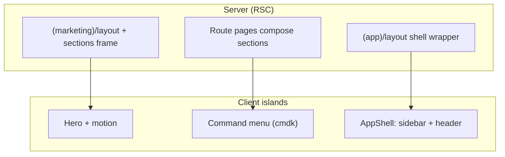
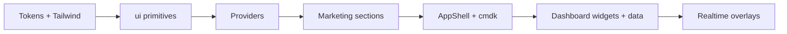

# LearnLoop — frontend foundation & UI system

This document describes the **architecture, design system, motion philosophy, and implementation order** for the LearnLoop product shell. It pairs with the implemented code under `src/app/`, `src/components/`, `src/features/`, `src/animations/`, and `src/hooks/`.

---

## 1. Frontend architecture

### 1.1 App Router structure

| Pattern | Why |
|--------|-----|
| **Route groups** `(marketing)`, `(app)`, `(auth)`, `(onboarding)` | Isolated layouts without polluting URLs; marketing stays fast and cache-friendly while the app shell loads heavier client islands only for authenticated surfaces. |
| **RSC by default** | Landing and dashboard *frames* render on the server; interactive hero, command palette, and sidebar state live in client boundaries. |
| **Colocated features** | `src/features/<domain>/components` keeps product slices portable — easier to delete, test, or lazy-load than a flat `components/` dump. |
| **Shared primitives in `components/ui`** | shadcn-style unstyled Radix primitives + tokens = one place to bump accessibility and density. |



### 1.2 Layout hierarchy

1. **`src/app/layout.tsx`** — fonts (Inter + JetBrains Mono), `ClerkProvider`, `AppProviders` (`ThemeProvider`, `QueryClient`, `TooltipProvider`), `globals.css` tokens.
2. **Marketing** — sticky glass header + footer; main is scroll narrative.
3. **App** — `AppShell`: persistent sidebar (desktop), drawer (mobile), sticky header with command trigger + theme toggle + `UserButton`.
4. **Auth** — centered mesh background; Clerk `SignIn` / `SignUp` with token-aligned appearance.
5. **Onboarding** — top rail + constrained column for stepper (future).

### 1.3 Reusable component strategy

- **`components/ui/*`** — design-system primitives (Button variants include `glow` for premium CTAs).
- **`components/layout/*`** — shells that appear on many routes.
- **`components/brand/*`** — logo lockup.
- **`features/*/components/*`** — marketing sections, future request composer, chat, etc.

### 1.4 State flow

- **Server state:** TanStack Query in `QueryProvider` (default `staleTime` tuned for dashboard lists).
- **URL state:** filters, tabs, pagination (shareable, back-button friendly).
- **Ephemeral UI:** sidebar mobile open, command palette open — local React state in `AppShell` / `useCommandMenu`.
- **Theme:** `next-themes` class strategy on `<html>` for zero-flash with `suppressHydrationWarning`.

### 1.5 Animation architecture

- **Primitives:** `src/animations/variants.ts` — shared `fadeInUp`, `staggerContainer`, spring configs (snappy vs soft).
- **Viewport:** `motionSafeViewport` — `once: true` to avoid replay churn; respects reduced motion via CSS + optional JS checks in intense components.
- **Rule:** prefer **transform/opacity** only; avoid layout-thrashing properties in scroll listeners.

### 1.6 UI abstraction strategy

- **Semantic tokens** in CSS variables — components never use raw hex; Tailwind maps `hsl(var(--primary))` etc.
- **Glass** via utility `.glass` / `.glass-subtle` — consistent blur + border for Arc/Linear-like depth.
- **Gradient borders** via `.gradient-border` — premium card emphasis without heavy images.

### 1.7 Scalability & maintainability

- Adding a new dashboard widget = new file under `features/dashboard/widgets/` + import in page (later).
- New marketing section = one component + one import on `(marketing)/page.tsx`.
- Design token change = single edit in `globals.css` + optional `tailwind.config.ts` extension.

---

## 2. Frontend folder structure (detailed)

```
src/
├── app/
│   ├── layout.tsx                 # Root: fonts, Clerk, AppProviders, CSS
│   ├── globals.css                # Design tokens + utilities
│   ├── (marketing)/
│   │   ├── layout.tsx             # MarketingHeader + Footer
│   │   ├── page.tsx               # Landing composition
│   │   └── pricing/page.tsx
│   ├── (app)/
│   │   ├── layout.tsx             # AppShell
│   │   └── dashboard/
│   │       ├── page.tsx           # Overview widgets
│   │       ├── requests/page.tsx
│   │       ├── requests/new/page.tsx
│   │       ├── sessions/page.tsx
│   │       ├── leaderboard/page.tsx
│   │       └── ai/page.tsx
│   ├── (auth)/
│   │   ├── layout.tsx
│   │   ├── sign-in/[[...sign-in]]/page.tsx
│   │   └── sign-up/[[...sign-up]]/page.tsx
│   ├── (onboarding)/
│   │   ├── layout.tsx
│   │   └── onboarding/page.tsx
│   └── api/…                      # (existing backend routes)
├── components/
│   ├── brand/logo.tsx
│   ├── layout/
│   │   ├── app-shell.tsx          # Sidebar + mobile drawer + header + cmdk
│   │   ├── app-sidebar.tsx
│   │   ├── app-header.tsx
│   │   ├── command-menu.tsx
│   │   ├── marketing-header.tsx
│   │   └── marketing-footer.tsx
│   ├── providers/
│   │   ├── app-providers.tsx
│   │   ├── theme-provider.tsx
│   │   └── query-provider.tsx
│   └── ui/                        # shadcn-style primitives
├── features/
│   ├── marketing/components/      # Hero, features, FAQ, CTA, …
│   └── dashboard/widgets/       # (add) stat cards, timelines, charts
├── animations/
│   ├── variants.ts
│   └── motion-config.ts
├── hooks/
│   ├── use-media-query.ts
│   ├── use-reduced-motion.ts
│   └── use-command-menu.ts
└── lib/utils.ts                   # cn()
```

---

## 3. Design system (complete)

### 3.1 Color palette (psychology)

- **Base:** deep blue-gray background (`--background`) — reduces glare; reads “tool for serious work” (Linear).
- **Foreground / muted:** high legibility hierarchy; muted for supporting copy so **primary actions** pop.
- **Primary (electric cyan):** signals *forward motion + intelligence* without clinical “hospital teal.”
- **Secondary (violet):** subtle cards / AI-adjacent surfaces — differentiates “human social” vs “machine insight.”
- **Glow token:** used sparingly for **hero**, **primary buttons**, **live indicators** — scarcity preserves premium feel.

**Light mode:** available via theme toggle; slightly warmer neutrals to avoid sterile white.

### 3.2 Typography

- **Sans:** Inter (UI density, legibility at small sizes).
- **Mono:** JetBrains Mono (credits, IDs, AI debug, keyboard hints — “engineering truth”).
- **Scale:** `text-display-*` for hero; body `text-sm`–`text-lg`; tight tracking on headings (Vercel-like).

### 3.3 Spacing & radius

- Tailwind default scale + **section rhythm** via component padding (`py-20 sm:py-28` on marketing).
- **Radius:** `sm` inputs, `md` buttons, `lg/xl` cards — consistent “soft industrial” curvature (Notion + GitHub).

### 3.4 Shadows & gradients

- **`shadow-card` / `shadow-card-hover`:** subtle lift on interactive cards.
- **`shadow-glow`:** reserved for **hero**, **live badges**, **primary CTA** — avoids “Christmas lights” UI.
- **`bg-mesh-gradient`:** multi-stop radial mesh — Arc-like atmosphere without bitmap assets.
- **`bg-grid-fade`:** technical credibility (Vercel / Vercel geist grid cues).

### 3.5 Glassmorphism

- Use **only** where hierarchy needs separation: headers, sticky bars, **command dialog**, floating panels.
- Always pair **blur + border + partial opacity**; never blur alone (washed-out mud).

### 3.6 Motion & transitions

- **Spring defaults** in `variants.ts`: stiff spring for UI chrome; softer for large surfaces.
- **CSS `prefers-reduced-motion`** in `globals.css` collapses durations — legal/ethical and Apple-like care.

### 3.7 Emotional UX

- **Trust:** stable grid, restrained color, monospace for “ledger-adjacent” data.
- **Excitement:** short bursts — hero progress bar, streak pill, live badge — not continuous noise.
- **Competence:** command palette + keyboard hints — power-user seduction (Raycast).

---

## 4. Global layout system

### 4.1 Navigation philosophy

- **Marketing:** anchor scroll + `/pricing` — shallow depth; CTA always visible in header when signed out.
- **App:** **sidebar = place**, **header = search + account**, **command = teleportation** — matches mental models from Linear + Raycast.
- **Mobile:** sidebar becomes **drawer**; command and search remain first-class (premium mobile ≠ dumbed-down).

### 4.2 Command palette

- **⌘K / Ctrl+K** toggles; items call `router.push` — later wire to server search + actions.
- **Glass dialog** — `CommandDialog` uses blurred card shell.

### 4.3 Notifications (future)

- Slide-in panel from header bell; optimistic read state; socket-triggered `AnimatePresence` list.

---

## 5. Landing page system (architecture)

| Section | Layout | Motion | Emotional goal |
|---------|--------|--------|------------------|
| **Hero** | Center stack + “live pulse” card | Stagger children; parallax `useScroll` on floating card | **Awe + clarity** — instant read of value prop |
| **Features** | 2×2 responsive grid | `whileInView` stagger | **Rational buy-in** — why architecture matters |
| **Gamification** | Center column + streak chip | Subtle badge motion | **Play without cringe** |
| **Social proof** | Split: copy / quotes | Stagger list | **Belonging** |
| **AI** | Split: terminal-like card / copy | Single reveal | **Trustworthy intelligence** |
| **FAQ** | Accordion-style static cards | Light fade | **Risk removal** |
| **CTA** | Full-width gradient panel | Glow shadow | **Commitment** |

**Parallax / mouse-follow (optional next):** bind hero glow to `useMotionValue` + `useSpring` for cursor lerp (keep amplitude < 12px to avoid seasickness).

**Smooth scroll:** `scroll-mt` on sections + `scroll-smooth` on `html` (add if desired — tradeoff: accessibility for some users).

---

## 6. Dashboard UI architecture

**Hierarchy (top → bottom):**

1. **KPI strip** — 4 tiles: active sessions, open requests, AI throughput, credits (tabular nums).
2. **Primary column (2/3):** activity timeline — socket-fed, grouped by day in future.
3. **Secondary column (1/3):** tutor shortlist — AI-ranked cards with explainability tooltip.

**Density:** default **comfortable**; compact mode later via `data-density` on `html` + CSS variables.

**Responsive:** stacks to single column < `lg`; KPIs 2×2 on `md`.

---

## 7. Realtime UI interactions (design)

| Pattern | Motion | Latency mask |
|---------|--------|--------------|
| **Notifications** | Slide + opacity; `layout` prop on list for reorder | Sound/haptic optional off; show “pending” chip |
| **Typing** | Dot wave 400ms loop | Debounce egress; cap update rate |
| **Online presence** | Pulse ring on avatar | Stale-while-revalidate; TTL coloring |
| **Counters** | `spring` on number change | Optimistic + rollback border flash |
| **Tutor matching** | Card stack micro-shift | Skeleton until first payload |

---

## 8. Motion design system (Framer Motion)

| Surface | Transition | Notes |
|---------|------------|-------|
| **Page** | fade + 8px Y | `pageTransition` variant — fast exit, slightly slower enter |
| **Modal / command** | zoom 0.96→1 + fade | Radix already animates; align durations |
| **Hover on cards** | `-translate-y-0.5` CSS | avoid motion per hover for perf |
| **Stagger lists** | 60ms children | cap max stagger |
| **Skeletons** | opacity pulse | prefer CSS `animate-pulse` over motion for rows |

**Easing:** cubic-bezier `[0.22, 1, 0.36, 1]` for “premium ease-out” on large fades.

---

## 9. Reusable component system (variants & a11y)

| Component | Variants | Animation | a11y | Responsive |
|-----------|----------|-----------|------|--------------|
| **Button** | default, outline, ghost, glow, destructive | optional `whileTap` scale 0.98 in wrappers | focus ring | full-width on mobile in forms |
| **Card** | default + gradient-border wrapper | hover shadow | — | stack |
| **Command** | — | dialog zoom | typeahead aria | full width dialog |
| **Sidebar** | collapsed (future) | drawer slide X | focus trap in mobile drawer | `md:` static |
| **Tabs** | default | — | roving tabindex | scroll horizontal on narrow |
| **Charts** (future) | sparkline / area | path draw optional | color-blind safe palette | lazy import |

---

## 10. Mobile responsive strategy

- **Breakpoints:** `sm` 640, `md` 768, `lg` 1024, `xl` 1280 — Tailwind defaults.
- **Sidebar:** `hidden md:flex` + fixed drawer `< md` with backdrop **blur** + click-outside close.
- **Touch:** min 44px tap targets on header icons; avoid hover-only affordances.
- **Performance:** prefer CSS transforms in marketing hero; lazy-load chart libraries on dashboard.

---

## 11. Frontend state + data flow

1. **Fetch in RSC** where possible (`profile`, static marketing).
2. **Client Query** for dashboards, infinite lists, refetch-on-focus for inbox (tune per surface).
3. **Mutations:** Server Actions return typed errors; on success `queryClient.invalidateQueries` + optional optimistic `setQueryData`.
4. **WebSocket:** maintain `lastSeenMessageId`; on reconnect refetch delta; merge with `AnimatePresence` for new rows.

---

## 12. Performance strategy

- **Code splitting:** `dynamic(() => import('./heavy-chart'), { ssr: false, loading: () => <Skeleton /> })`.
- **Images:** `next/image` with explicit sizes; blur placeholders for avatars.
- **Animation:** `will-change` only during active transition; remove after.
- **Memoization:** `React.memo` on row components in long lists; stable `key` from server IDs.
- **Suspense:** route-level `loading.tsx` per `(app)` segment for streaming shells.

---

## 13. Implementation order



| Priority | Work | MVP vs polish |
|----------|------|----------------|
| 1 | `globals.css` + `tailwind.config.ts` | MVP |
| 2 | `Button`, `Card`, `Dialog`, `Command` | MVP |
| 3 | `AppProviders` | MVP |
| 4 | Marketing landing | MVP |
| 5 | `AppShell` + nav | MVP |
| 6 | Dashboard data hooks | MVP |
| 7 | Charts + AI side panel | Polish |
| 8 | Onboarding stepper motion | Polish |
| 9 | Mouse-follow hero | Demo wow |

**Parallelizable:** marketing sections by different contributors; `ui/*` primitives vs `layout/*`.

---

## 14. Advanced “wow” ideas (demo / judges)

1. **Command center** — cmdk + AI slash commands (`/summarize last session`).
2. **AI assistant sidebar** — resizable panel with thread + “apply to request” chips.
3. **Dynamic gradients** — mesh stops shift slowly (`useMotionTemplate` + CSS vars).
4. **Interactive graphs** — session throughput brush-linked to timeline.
5. **Profile analytics radar** — teaching vs learning dimensions.
6. **Gamified celebrations** — confetti burst **only** on first-time achievements (respect reduced motion).
7. **Realtime achievement unlock** — toast slides in from top with trophy Lottie (optional).
8. **“Presence orbs”** on tutor cards — soft pulsing ring when online (SVG + CSS).

---

## Implemented entry points (codebase)

- **Tokens & Tailwind:** `src/app/globals.css`, `tailwind.config.ts`, `postcss.config.mjs`
- **Primitives:** `src/components/ui/*`
- **Providers:** `src/components/providers/*`
- **Marketing:** `src/app/(marketing)/*`, `src/features/marketing/components/*`
- **App shell:** `src/components/layout/app-shell.tsx` + sidebar/header/command
- **Dashboard stubs:** `src/app/(app)/dashboard/*`

Extend by adding **widgets** under `src/features/dashboard/widgets/` and importing them into `dashboard/page.tsx` — keeps the overview readable as the product grows.
